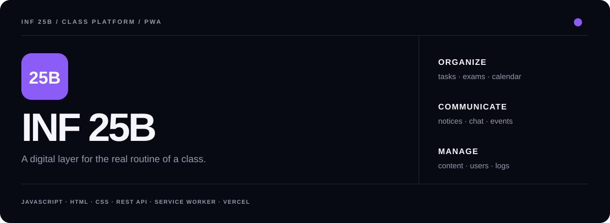

<p align="center">
  
</p>

<p align="center">
  <a href="#what-it-does"><b>Features</b></a>
  &nbsp;&nbsp;•&nbsp;&nbsp;
  <a href="#running-locally"><b>Local setup</b></a>
  &nbsp;&nbsp;•&nbsp;&nbsp;
  <a href="#pwa"><b>PWA</b></a>
  &nbsp;&nbsp;•&nbsp;&nbsp;
  <a href="#quality"><b>Quality</b></a>
</p>

<br>

## What it is

**INF 25B** is a responsive class platform built around the actual routine of my school group. It started as a small place for tasks and announcements and grew as new problems appeared.

Instead of spreading information across messages, screenshots and isolated tools, the platform gives the class one shared place for school routine, communication and participation.

## What it does

<table>
<tr>
<td width="25%" valign="top">

### Routine

Assignments, exams, holidays, subject materials and upcoming deadlines.

</td>
<td width="25%" valign="top">

### Information

Announcements, timetable, documents, important contacts and calendar views.

</td>
<td width="25%" valign="top">

### Community

Events, attendance, polls, suggestions, class projects and social sections.

</td>
<td width="25%" valign="top">

### Communication

General chat, direct messages, notifications and leadership/admin responses.

</td>
</tr>
</table>

<br>

## Product areas

- authenticated access and account flow;
- dashboard with announcements, schedule, calendar and participation;
- assignments, exams, holidays and materials by subject;
- documents, timetable and important contacts;
- events, attendance, Instagram, class shirt and polls;
- suggestions with voting, status and leadership response;
- profile, theme and opt-in notifications;
- general chat and direct messages;
- admin tools for content, users and logs.

## Stack

| Layer | Current approach |
|---|---|
| **Interface** | HTML, CSS and modular JavaScript |
| **Application layer** | Shared session/API utilities and page-specific modules |
| **Back-end connection** | REST API, configurable in local development |
| **Offline / installable** | Web App Manifest + Service Worker |
| **Deployment** | Static deployment on Vercel |
| **Quality** | Local validation script + GitHub Actions |

## Running locally

```bash
npm ci
npm run check
npm run serve
```

Open `http://localhost:5500`.

In local development the front-end expects the API at `http://localhost:2025`. The access screen also exposes a development URL setting so the API endpoint can be changed without rebuilding the entire interface.

## Deployment

The project can be deployed as a static Vercel site. `vercel.json` already contains security headers and CSP configuration.

If the public back-end URL changes, keep these values synchronized:

1. the `API_URL` fallback in `js/app.js`;
2. `connect-src` in `vercel.json`;
3. `FRONTEND_URLS` in the back-end.

## PWA

The Service Worker keeps the application shell available offline, while notifications are only requested after explicit user action.

The repository includes standard and maskable app icons in `assets/` and shortcuts for high-frequency areas such as agenda, chat and suggestions.

## Quality

Every push to `main` and every pull request runs the repository validation script in **GitHub Actions**.

```text
push / pull request
        │
        ▼
GitHub Actions
        │
        ├─ npm ci
        └─ npm run check
             ├─ JavaScript validation
             └─ HTML checks
```

Workflow: [`.github/workflows/quality.yml`](./.github/workflows/quality.yml)

## Repository structure

```text
inf_25b/
├── assets/          icons and visual assets
├── css/             shared and page styles
├── html/            application screens
├── js/              components, session/API and page logic
├── scripts/         repository validation tools
├── manifest.json    installable PWA metadata
├── sw.js            service worker
└── vercel.json      deployment and security configuration
```

---

<p align="center">
  <b>Built for a real class, changed by real use.</b><br>
  <sub>Gabriel Reguse · INF 25B</sub>
</p>
